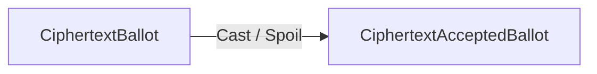

```mermaid
graph LR
    PlaintextBallot -- Encrypt --> CiphertextBallot
```

```mermaid
graph LR
    CiphertextBallot -- Cast / Spoil --> CiphertextAcceptedBallot
```

```mermaid
graph LR
    CiphertextAcceptedBallot -- Accumulate --> CiphertextTally
```